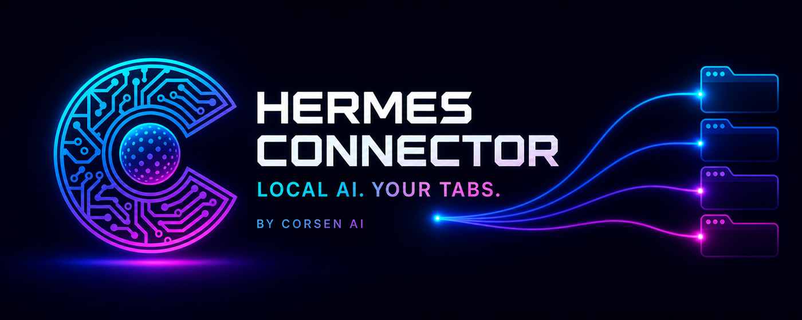
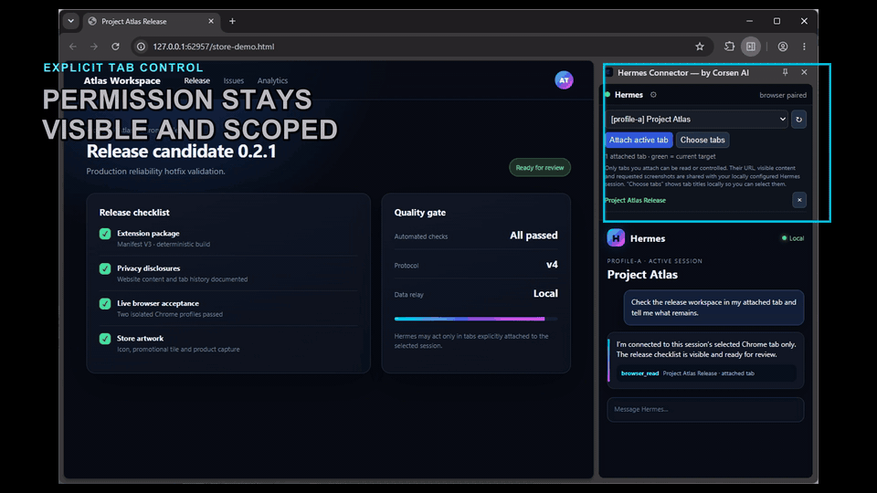
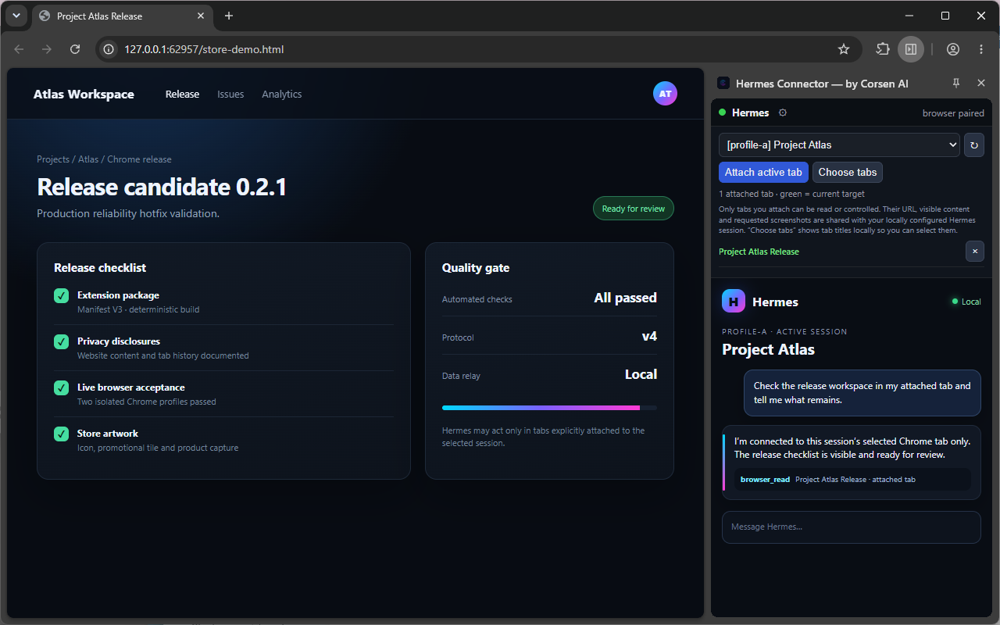

# Hermes Connector — Chrome browser extension for Hermes Agent

Hermes Connector is an open-source Chrome browser extension for Hermes Agent
that connects an exact Hermes profile and session to the signed-in Chrome tabs
you choose. Hermes can then read and control those tabs without using a hidden
automation browser or guessing which tab belongs to which task.



[**Install version 0.2.2 from the Chrome Web Store**](https://chromewebstore.google.com/detail/hermes-connector-%E2%80%94-by-cor/cdhaldcgafmkcnpanlmmpaebabnlledm)
· [Setup guide](https://corsenai.github.io/hermes-connector/)
· [Download companion 0.2.2](https://github.com/CorsenAI/hermes-connector/releases/download/v0.2.2/hermes-connector-0.2.2-companion.zip)
· [Get support](https://corsenai.github.io/hermes-connector/support/)

> Unofficial community project by Corsen AI. Not affiliated with or endorsed
> by Nous Research or Google.

## Current release and compatibility

The public Chrome Web Store release is **0.2.2**. The Chrome extension and local
companion must use exactly the same version.

| Chrome extension | Matching companion | Protocol / default broker | Status |
| --- | --- | --- | --- |
| 0.2.2 | [Companion 0.2.2](https://github.com/CorsenAI/hermes-connector/releases/download/v0.2.2/hermes-connector-0.2.2-companion.zip) | Protocol 4 / `127.0.0.1:8766` | Current public release |
| 0.2.1 | [Companion 0.2.1](https://github.com/CorsenAI/hermes-connector/releases/download/v0.2.1/hermes-connector-0.2.1-companion.zip) | Protocol 4 / `127.0.0.1:8766` | Legacy released or sideloaded pair |
| 0.2.0 | [Companion 0.2.0](https://github.com/CorsenAI/hermes-connector/releases/download/v0.2.0/hermes-connector-0.2.0-companion.zip) | Protocol 3 / `127.0.0.1:8765` | Legacy pair; see the disk-recovery procedure |

Do not mix versions. Check `chrome://extensions` before installing a companion.
The complete compatibility, upgrade, and version 0.2.0 LevelDB recovery guide
is available on the [support page](https://corsenai.github.io/hermes-connector/support/).



## Your Hermes session, inside the Chrome you already use

Hermes Connector embeds the real local Hermes dashboard in Chrome's side panel.
You decide which tabs each Hermes session may access, and the connector keeps
that scope exact even when several projects, sessions, or Chrome profiles are
running at the same time.



With an attached tab, Hermes can:

- inspect and read the visible page;
- navigate, click, type, scroll, hover, select, drag, and use keyboard actions;
- find text, use browser history, and take requested screenshots;
- open, list, switch, and close tabs inside that session's authorized scope;
- keep concurrent Hermes projects isolated from one another.

This is real browser control with an explicit boundary: a tab is unavailable to
Hermes until you attach it. If a Hermes session has no attached target, its
browser action fails visibly instead of falling back to the last active tab.

## Why the routing stays precise

| You choose | Hermes Connector guarantees |
| --- | --- |
| A real Hermes profile and session | Every browser request is routed back to that exact session. |
| One or more Chrome tabs | Only those attached tabs can be read or controlled. |
| A named Chrome profile | Its local browser identity remains distinct from other Chrome profiles. |
| Whether to enable Trusted input | Chrome's debugger transport stays off unless you explicitly enable it. |

The result is useful for everyday browsing as well as parallel agent workflows:
your authenticated websites remain available in your normal Chrome profile,
while each Hermes task receives only the tabs assigned to it.

## Quick start

You need a local Hermes Agent installation, desktop Chrome 120 or newer, and the
small Hermes Connector companion. The extension's first-run screen detects your
operating system, checks whether the companion is already reachable, and shows
the appropriate Windows, macOS, or Linux instructions.

### 1. Install the Chrome extension

[Install Hermes Connector from the Chrome Web Store](https://chromewebstore.google.com/detail/hermes-connector-%E2%80%94-by-cor/cdhaldcgafmkcnpanlmmpaebabnlledm),
verify that `chrome://extensions` shows version **0.2.2**, then click its toolbar
icon or press `Ctrl+Shift+H` (`Command+Shift+H` on macOS) to open the side panel.

### 2. Let the extension check the companion

On first launch, Hermes Connector checks only your computer's loopback address.
It does not send this check to the internet.

- If the panel says the matching companion is already reachable, do not reinstall it.
- Otherwise, use the panel's **Download companion** button and extract the ZIP.

The current matching download is
[`hermes-connector-0.2.2-companion.zip`](https://github.com/CorsenAI/hermes-connector/releases/download/v0.2.2/hermes-connector-0.2.2-companion.zip).

### 3. Install the companion once

**Windows:** double-click `Install Hermes Connector.cmd` in the extracted
folder, or run `\.\install.ps1` from PowerShell. Keep the result window open so
you can copy the pairing code.

**macOS or Linux:** open a terminal in the extracted folder and run:

```sh
./install.sh
```

Restart any Hermes dashboard, gateway, or chat process that was already
running. The installer adds the connector plugin to the shared Hermes home and
existing named profiles, then prints one private pairing code. Re-run the
installer after creating a new named Hermes profile.

### 4. Pair Chrome and choose the tabs

In the Hermes Connector side panel:

1. Give this Chrome profile a recognizable name.
2. Paste the pairing code printed by the installer and save.
3. Select the Hermes profile and session you want to use.
4. Choose **Attach active tab** or **Choose tabs**.
5. Ask Hermes to work with the selected page.

For example:

```text
Read the release checklist in my attached tab and tell me what remains.
```

or:

```text
Click the requested action in my attached tab, then explain what changed.
```

Tab titles and URLs are displayed locally when you open **Choose tabs** so that
you can make the selection yourself.

## Why a companion is required

A Chrome extension cannot register browser tools directly inside a local Hermes
installation. The companion installs that Hermes-side plugin and runs the
authenticated loopback broker used by the extension. It is bundled in the
public release archive and does not create a Corsen AI cloud relay.

```text
Hermes profile and session
  -> Hermes Connector companion
  -> authenticated broker on 127.0.0.1:8766
  -> exact local Chrome profile identity
  -> explicitly attached tabs
  -> requested browser action
```

Chrome automatically updates the Store extension. It cannot update a local
companion, so after an extension version change you must install the companion
with exactly the same version and restart Hermes. If you remove and reinstall
the extension, or add it to another Chrome profile, the first-run check detects
an already-running compatible companion and avoids asking you to install it
again.

## Privacy and security

Hermes Connector is designed to keep authority visible and local:

- no Corsen AI relay, account, advertising, analytics, tracking, or telemetry;
- loopback-only connector transport on `127.0.0.1`;
- explicit tab attachment and exact session-to-tab authorization;
- separate persistent identities for separate Chrome profiles;
- role-bound mutual HMAC authentication without sending the pairing secret;
- sensitive form-field and URL-secret redaction in browser snapshots;
- bounded protocol messages and fail-closed routing;
- Trusted input disabled by default, with Chrome's debugger banner visible when
  you enable it for reliable native input or dialog handling.

Page content is sent to the user's local Hermes installation. A remote model
provider receives it only if the user has configured Hermes to use that
provider. Attach only tabs you are comfortable sharing with that configuration.

Read the full [privacy policy](PRIVACY.md), [product specification](docs/PRODUCT-SPEC.md),
and [acceptance gates](docs/ACCEPTANCE.md).

## Project structure

- `extension/`: reviewable Manifest V3 Chrome extension.
- `hermes-plugin/`: cross-platform Hermes companion and local broker.
- `scripts/`: installation, packaging, and deterministic release tooling.
- `tests/`: routing, installer, security, UI-module, and live-browser tests.
- `docs/`: product contract, architecture, setup, and release acceptance gates.
- `store/`: Chrome Web Store copy and approved visual assets.

## Build and verify

The normal Store installation does not require Developer mode. The following
commands are only for contributors and release verification.

Run the isolated test gate:

```powershell
& "$env:LOCALAPPDATA\hermes\hermes-agent\venv\Scripts\python.exe" tests\run_all.py
```

Run live extension acceptance with Chromium or Chrome for Testing:

```powershell
& "$env:LOCALAPPDATA\hermes\hermes-agent\venv\Scripts\python.exe" tests\e2e_chromium.py
```

Run the two-profile isolation and ownership-transfer acceptance test:

```powershell
& "$env:LOCALAPPDATA\hermes\hermes-agent\venv\Scripts\python.exe" tests\e2e_multi_browser.py
```

For a release, `scripts/package.ps1` refuses an uncommitted source tree, runs
the fast tests, produces deterministic allowlisted ZIPs, and records SHA-256
hashes in `dist/release-<version>.json`. Explicit `-AllowDirty` development
builds are isolated under `dist/dev/` and must not be uploaded to the Store.

## Support and transparency

- [Chrome Web Store listing](https://chromewebstore.google.com/detail/hermes-connector-%E2%80%94-by-cor/cdhaldcgafmkcnpanlmmpaebabnlledm)
- [Setup and downloads](https://corsenai.github.io/hermes-connector/)
- [Version compatibility, upgrade, and troubleshooting](https://corsenai.github.io/hermes-connector/support/)
- [Privacy policy](https://corsenai.github.io/hermes-connector/privacy/)
- [Source code and releases](https://github.com/CorsenAI/hermes-connector)

Hermes Connector is released under the [MIT License](LICENSE).
